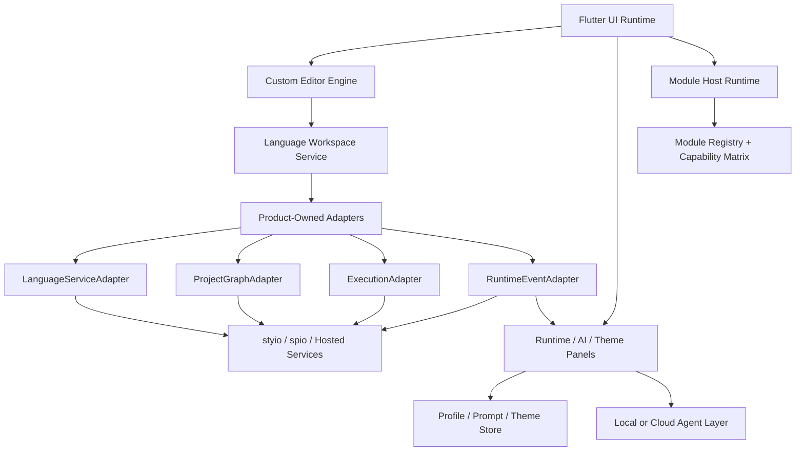

# Styio View System Architecture

**Purpose:** 定义 `styio-view` 的系统层次、adapter 边界、平台执行后端与主线实现策略；具体产品语义以 [Styio-View-Product-Spec.md](./Styio-View-Product-Spec.md) 为准。

**Last updated:** 2026-04-21

**Status:** Draft SSOT

## 1. 总体架构

`styio-view` 采用 `Flutter UI + Custom Editor Engine + Module Host Runtime + Product-Owned Adapter Layer + 分平台执行后端` 的体系。

## 1.1 前端 / 后端切面

这里的“前端 / 后端”不是按单一仓库目录硬切，而是按产品责任切：

- 前端是面向用户的 `Flutter UI Runtime + Custom Editor Engine + Panels + Module Host`，负责编辑、浏览、交互和状态呈现。
- 后端是 `styio-view` 背后的整条工具链面，包含 adapter layer、local CLI / FFI、hosted control plane，以及上游 `spio` / `styio` 提供的 machine contract。
- `prototype/` 与 `frontend/styio_view_app/lib/src/app|editor|runtime|agent|theme|module_host|platform` 属于前端主面；`frontend/styio_view_app/lib/src/frontend_shell/` 是这组壳层模块对外聚合的显式入口边界。
- `frontend/styio_view_app/lib/src/backend_toolchain/` 是后端工具链接入的实现根目录，承载 adapter、hosted control plane codec 和产品运维 lane。
- `frontend/styio_view_app/lib/src/integration/` 只保留 legacy compatibility exports；它继续服务旧 import 路径，但不再承载新的后端实现。

非协商规则：

1. 前端不重新实现 compiler、resolver、registry、publish、worker scheduling 语义。
2. 后端不输出只为某个页面私定的状态拼装；它输出 machine contract 和 domain payload。
3. Web hosted workspace、iOS cloud-only、Android cloud fallback 都属于后端执行/工具链路线，不属于前端业务逻辑。
4. 新增后端实现默认进入 `backend_toolchain/`；`integration/` 不得重新生长成第二套逻辑根目录。

## 2. 主要层次

### 2.1 Flutter UI Runtime

负责：

1. 窗口、页面、动画、手势和多平台壳
2. 编辑器渲染层
3. 底部运行视图、AI 面板、主题编辑器

不负责：

1. 语言语义裁决
2. 编译器核心逻辑
3. 项目图和包管理状态的推断

### 2.2 Module Host Runtime

负责：

1. core module 与 optional module 的装载关系
2. module manifest 与 capability matrix
3. staged update
4. 安装、卸载、禁用、重启后激活的生命周期
5. 平台化的数据回收与入口回收策略

关键原则：

1. 当前会话中的模块版本保持稳定。
2. 新版本只进入 staged 状态，重启后激活。
3. iOS 不挂载本地编译模块。

### 2.3 Custom Editor Engine

负责：

1. 文档模型
2. 光标与选择
3. 输入法与键盘映射
4. 行布局、块布局、overlay、装饰层
5. visual substitution 和 semantic block surface

关键原则：

1. Source Buffer 与显示层严格分离。
2. glyph substitution 由装饰层完成，不写回原文。
3. 结构装饰由语言服务驱动。
4. substitution 状态属于配置层，不改变底层文档模型。

### 2.4 Product-Owned Adapter Layer

`styio-view` 主线只依赖以下四个合同：

1. `LanguageServiceAdapter`
2. `ProjectGraphAdapter`
3. `ExecutionAdapter`
4. `RuntimeEventAdapter`

每个合同允许三种实现形态：

1. `CLI Adapter`
2. `FFI Adapter`
3. `Cloud Adapter`

关键原则：

1. `styio-view` 拥有产品合同，上游来适配。
2. Flutter 主线不依赖上游内部源码结构、类名或某个专门命名的 native 包。
3. 缺能力时，adapter 返回 capability gap，不让 UI 崩溃或猜状态。
4. `DependencySourceAdapter`、`DeploymentAdapter`、`ToolchainManagementAdapter` 这三条产品运维 lane 也属于同一后端工具链面，不能回流进 UI 层自行实现。

### 2.5 Language Workspace Service

负责：

1. 把当前文档和工作区提交给 `LanguageServiceAdapter`
2. 组织 token、semantic span、diagnostic、quick fix、formatting、completion、hover
3. 把结果回流到编辑器渲染层和 inspector

关键原则：

1. 基础高亮先消费 `TokenSpan`，再叠加 `SemanticSpan`。
2. diagnostics 与 quick fix 属于独立层，不负责基础高亮。
3. 格式化返回补丁，不直接改写 Source Buffer。
4. 合同结构借鉴 LSP，但实现自研。

正式合同见：

1. [../contracts/LanguageServiceAdapter.md](../contracts/LanguageServiceAdapter.md)

### 2.6 Project Graph Service

负责：

1. 读取 canonical project files 或 machine payload
2. 暴露 workspace graph、targets、toolchain、lock/vendor/build 状态
3. 驱动左侧工程树、target selector 和 toolchain badge

关键原则：

1. `styio-view` 不通过私有目录结构推断业务状态。
2. `spio.toml / spio.lock / spio-toolchain.toml / .spio / styio.toml` 是当前允许的 canonical files。
3. 一旦 `spio` 发布正式 project graph payload，主线切到 payload。

正式合同见：

1. [../contracts/ProjectGraphAdapter.md](../contracts/ProjectGraphAdapter.md)

### 2.7 Execution Service

负责：

1. 保存后编译、显式运行和状态回流
2. compile/run session 管理
3. stdout / stderr / diagnostic 日志回流

关键原则：

1. scratch file 路径与项目路径可以不同实现，但都落到同一 `ExecutionSession` 合同上。
2. 当前未发布的执行路径必须明确返回 `blocked`。
3. iOS 主线只走 cloud execution。

正式合同见：

1. [../contracts/ExecutionAdapter.md](../contracts/ExecutionAdapter.md)

### 2.8 Runtime Event Service

负责：

1. 统一 runtime 事件 envelope
2. 驱动 thread lanes、状态机图、debug console
3. 保证未知事件只降级，不崩溃

正式合同见：

1. [../contracts/RuntimeEventAdapter.md](../contracts/RuntimeEventAdapter.md)
2. [../contracts/AdapterCapabilitySnapshot.md](../contracts/AdapterCapabilitySnapshot.md)

## 3. 平台执行矩阵

| Platform | Primary Project Graph Route | Primary Execution Route | Notes |
|----------|-----------------------------|-------------------------|-------|
| macOS / Windows / Linux | CLI or FFI | CLI first, FFI optional | 桌面主线 |
| Android | CLI or Cloud | Local-first, Cloud fallback | 本地能力可卸载 |
| iOS | Cloud | Cloud only | 不暴露本地编译模块 |
| Web | Cloud | Cloud only | hosted workspace 主路径 |

## 4. 当前主线策略

1. 主线先用已发布的 `styio` single-file CLI 能力和 `jsonl diagnostics`。
2. 项目图当前可基于 canonical files 做 partial inference。
3. `FFI Adapter` 是统一原生接入标识，不再引入单独的 native bridge 品牌名。
4. 上游一旦补齐正式 machine contract，只替换 adapter 实现，不重构 Flutter UI 和编辑器语义。

## 5. 当前代码锚点

当前已落地的实现入口：

1. `frontend/styio_view_app/lib/src/frontend_shell/frontend_shell.dart`
2. `frontend/styio_view_app/lib/src/backend_toolchain/backend_toolchain.dart`
3. `frontend/styio_view_app/lib/src/backend_toolchain/adapter_contracts.dart`
4. `frontend/styio_view_app/lib/src/backend_toolchain/project_graph_contract.dart`
5. `frontend/styio_view_app/lib/src/backend_toolchain/project_graph_adapter.dart`
6. `frontend/styio_view_app/lib/src/backend_toolchain/execution_adapter.dart`
7. `frontend/styio_view_app/lib/src/backend_toolchain/runtime_event_adapter.dart`
8. `frontend/styio_view_app/lib/src/integration/`
9. `frontend/styio_view_app/lib/src/app/app_bootstrap.dart`
10. `frontend/styio_view_app/lib/src/app/layout/styio_shell_scaffold.dart`
