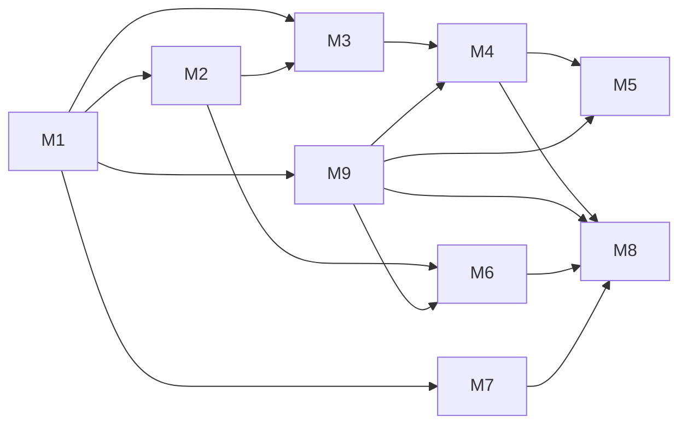

# Styio View Milestone Index — 2026-04-12

**Purpose:** 冻结 `styio-view` 首批实施里程碑、依赖链和验收门禁；具体任务见各里程碑文件。

**Last updated:** 2026-04-12

**Status:** Active milestone batch

## 1. 批次目标

把 `styio-view` 从“仅有方向”推进到“桌面最小闭环 + 模块宿主与 staged update 基线 + 运行视图骨架 + AI 面板骨架 + 移动端分平台策略”。

## 2. 里程碑列表

| Milestone | File | Goal |
|-----------|------|------|
| M1 | [M1-Foundation-And-Desktop-Shell.md](./M1-Foundation-And-Desktop-Shell.md) | 冻结工程骨架、文档、Flutter 桌面壳与基础导航 |
| M2 | [M2-Editor-Core.md](./M2-Editor-Core.md) | 建立自研文档模型、输入、选择、渲染基本盘 |
| M3 | [M3-Semantic-Surfaces-And-Language-Bridge.md](./M3-Semantic-Surfaces-And-Language-Bridge.md) | 冻结语言层产品合同、语义表面与 `CLI / FFI / Cloud` adapter 槽位 |
| M4 | [M4-Desktop-Compile-And-Run.md](./M4-Desktop-Compile-And-Run.md) | 桌面端完成保存编译、快捷键运行和诊断闭环 |
| M5 | [M5-Runtime-Surface.md](./M5-Runtime-Surface.md) | 交付底部运行视图、线程轨与图模型最小闭环 |
| M6 | [M6-AI-Surface.md](./M6-AI-Surface.md) | 交付 IDE 内建 AI 面板、prompt profile 与上下文注入 |
| M7 | [M7-Theme-And-Profile-System.md](./M7-Theme-And-Profile-System.md) | 交付主题分层、预设主题与 profile 骨架 |
| M8 | [M8-Mobile-Runtime-And-Cloud-Path.md](./M8-Mobile-Runtime-And-Cloud-Path.md) | 交付 Android 本地优先、iOS 云执行与 Web hosted workspace 主路径 |
| M9 | [M9-Module-Runtime-And-Staged-Hot-Update.md](./M9-Module-Runtime-And-Staged-Hot-Update.md) | 交付模块挂载、卸载、分端能力矩阵、数据回收与 staged update |

## 3. 依赖图

## 4. 批次门禁

1. 每个里程碑都必须有明确退出条件。
2. 没有对应 ADR 的长期架构边界不得推进到实现。
3. 任何平台承诺都必须能映射到 `docs/assets/workflow/TEST-CATALOG.md`。
