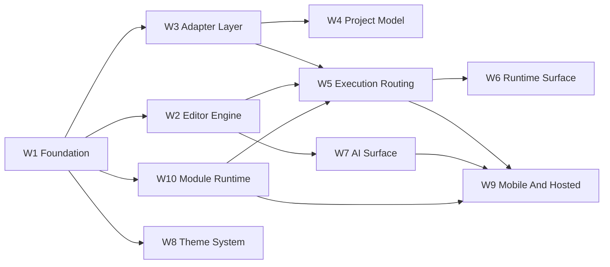

# Styio View Implementation Plan

**Purpose:** 给出 `styio-view` 从产品合同冻结到跨端实现的实施顺序、工作流拆分、依赖链与阶段性门禁。

**Last updated:** 2026-04-17

**Status:** Active plan

## 0. 与三仓统一总纲的关系

`styio-view` 的跨仓里程碑以 [Styio-Ecosystem-Delivery-Master-Plan.md](./Styio-Ecosystem-Delivery-Master-Plan.md) 为镜像入口，权威副本位于 `styio-nightly`。

本文件继续负责 `view` 自己的工作流拆分和实施顺序，但不得私自改写三仓共同的 milestone ID、repo exit 或 cutover 定义。

当前映射关系固定为：

| Ecosystem milestone | `styio-view` workstreams | 本仓含义 |
|---------------------|--------------------------|----------|
| `M0` | `W1` | 产品合同、文档策略、adapter 边界、团队协作入口锁定 |
| `M1` | `W3` + `W5` compiler side consumption | 正式消费 `styio-nightly` 发布的 language/execution contract |
| `M2` | `W3` + `W4` + `W5` package/environment consumption | 正式消费 `spio` 的 project graph/toolchain/source/registry state |
| `M3` | `W2` + `W4` + `W5` | IDE core、project UI、execution shell、environment shell 闭合 |
| `M4` | `W6` + `W7` + `W8` + `W10` | runtime surface、AI、theme、module runtime 闭合 |
| `M5` | `W9` | Android、本地/云 iOS、Web hosted workspace 路线闭合 |
| `M6` | hardening across `W1-W10` | 完整产品级 IDE 与样板项目矩阵闭合 |

## 1. 实施目标

在不复用传统 IDE 组件的前提下，分阶段交付：

1. Flutter 主前端
2. 自研编辑器引擎
3. 产品拥有的 adapter 合同
4. canonical project model
5. scratch file 与项目路径的执行闭环
6. runtime surface
7. AI 面板
8. 主题系统
9. Android 本地优先能力
10. iOS 云执行能力
11. 模块挂载、卸载与 staged update 体系

## 2. 工作流拆分

| Workstream | Scope | First Major Exit |
|------------|-------|------------------|
| W1 Product Foundation | 文档、目录、合同、ADR、平台边界 | `docs/contracts/` 与 handoff 目录冻结 |
| W2 Editor Engine | 文档模型、布局、选择、输入、装饰层 | 可编辑的自研文本引擎 |
| W3 Adapter Layer | 语言、项目图、执行、runtime 事件的产品合同与实现槽位 | Flutter 只依赖 adapter |
| W4 Project Model | `spio.toml / spio.lock / spio-toolchain.toml / .spio / styio.toml` UI 与状态模型 | 正式项目图主线 |
| W5 Execution Routing | scratch single-file、project preview、cloud route | 执行路径与 capability gap 可视化 |
| W6 Runtime Surface | 底部运行图、线程轨与状态视图 | runtime 面板最小闭环 |
| W7 AI Surface | Agent 面板、provider adapter、prompt/profile 接入 | IDE 内建 AI 壳闭环 |
| W8 Theme System | 预设主题、分层主题、自定义存储 | 可切换/可编辑主题 |
| W9 Mobile And Hosted | Android 本地优先、iOS 云执行、Web hosted workspace | 移动端与云端首批可用路径 |
| W10 Module Runtime | 模块 manifest、capability matrix、安装/卸载、数据回收、staged update | 模块宿主闭环 |

## 3. 依赖顺序

## 4. 当前主线策略

1. `styio-view` 先冻结产品合同和 adapter 边界。
2. 主线先支持 `CLI Adapter`。
3. `FFI Adapter` 是统一本地原生接入标识。
4. `Cloud Adapter` 作为移动端和 hosted workspace 的补充。
5. 上游缺能力时，写入 `../for-styio/` 或 `../for-spio/`，不牺牲产品语义。
6. 三仓共同里程碑变化必须先回写镜像总纲，再调整本文件中的 workstream 顺序和出入口。

## 5. 当前项目级任务清单

### 5.1 W1 Product Foundation

1. 冻结 `docs/contracts/`
2. 建立 `docs/for-styio/` 与 `docs/for-spio/` handoff
3. 固定 Flutter 作为主前端
4. 固定平台执行矩阵
5. 建立 capability gap 验收规则

### 5.2 W2 Editor Engine

1. `DocumentState` 与撤销模型
2. 多层渲染：文本层、装饰层、overlay 层
3. glyph substitution 与光标映射
4. semantic block surface
5. 桌面快捷键与移动手势模型

### 5.3 W3 Adapter Layer

1. 定义 `LanguageServiceAdapter`
2. 定义 `ProjectGraphAdapter`
3. 定义 `ExecutionAdapter`
4. 定义 `RuntimeEventAdapter`
5. 定义 `AdapterCapabilitySnapshot`
6. 主壳只消费 adapter，不直接依赖上游内部实现

### 5.4 W4 Project Model

1. 围绕 `spio.toml / spio.lock / spio-toolchain.toml / .spio / styio.toml` 建立项目 UI
2. 项目树、workspace members、dependencies、targets、toolchain、lock/vendor/build 状态
3. 正式消费 `project_graph / toolchain_state / source_state / package_distribution`，不再停留在 compile-plan preview 占位

### 5.5 W5 Execution Routing

1. scratch single-file 路径
2. 项目路径的 live build/run/test / JIT / deploy preflight 路由
3. capability gap 与 blocked status UI，仅用于尚未发布的上游路径
4. `Cmd/Ctrl+Enter` 命令路由
5. `Required Handoffs` UI，只陈述上游需要交付的 machine contract

### 5.6 W6 Runtime Surface

1. `RuntimeEventEnvelope`
2. thread lanes / graph view 的最小数据模型
3. runtime feature registry

### 5.7 W7 AI Surface

1. agent panel 的输入/输出协议
2. prompt profile 存储
3. `OpenAI-compatible endpoint` adapter
4. local bridge / cloud provider 入口

### 5.8 W8 Theme System

1. 主题分层模型
2. 预设主题
3. 用户局部覆写

### 5.9 W9 Mobile And Hosted

1. Android 本地优先路径
2. iOS 云执行路径
3. Web hosted workspace 生命周期
4. 移动端交互模型

### 5.10 W10 Module Runtime

1. `ModuleManifest`
2. `ModuleCapabilityMatrix`
3. core / optional module 生命周期
4. staged update
5. 平台化卸载回收策略

## 6. 跨阶段门禁

1. 没有正式产品合同前，不把 Flutter 与上游实现绑死。
2. 没有 capability gap 语义前，不承诺任何未发布的执行路径。
3. 没有 project graph contract 前，不通过私有目录猜业务状态。
4. 没有 runtime event contract 前，不承诺复杂运行图。
5. 没有模块 lifecycle 协议前，不承诺热更新或按端卸载能力。

## 7. 当前下一步

1. 继续推进编辑器 token 级 pointer 交互和 project graph UI
2. 用已发布 CLI 能力补强 scratch execution 路线
3. 并行向 `styio` 索要 language/execution/runtime handoff
4. 并行向 `spio` 索要 project graph/workflow/toolchain/registry handoff
5. 先修 W4/W5 当前缺陷：真实文件 staging 覆写窗口、跨文件 diagnostics 定位退化、published payload 解析失败后的静默 fallback
