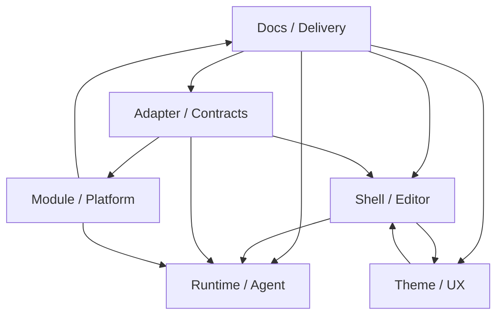

# Coordination Runbook

**Purpose:** 提供 `styio-view` 的日常协调入口；显式维护团队 ownership、review routing、升级路径和 checkpoint 纪律，但不替代产品规格、系统架构或 adapter 合同 SSOT。

**Last updated:** 2026-04-17

## Mission

协调者负责保持团队边界清晰、跨团队 review 可发现、handoff 可恢复，并防止产品语义、平台策略和 adapter 合同在并行修改中漂移。该角色不重写产品规格、系统架构或上游 handoff 边界。

权威入口：

1. 产品规格：[../design/Styio-View-Product-Spec.md](../design/Styio-View-Product-Spec.md)
2. 系统架构：[../design/Styio-View-System-Architecture.md](../design/Styio-View-System-Architecture.md)
3. 仓库边界：[../specs/REPOSITORY-MAP.md](../specs/REPOSITORY-MAP.md)
4. 文档策略：[../specs/DOCUMENTATION-POLICY.md](../specs/DOCUMENTATION-POLICY.md)
5. 人机协作规范：[../specs/CONTRIBUTOR-AND-AGENT-SPEC.md](../specs/CONTRIBUTOR-AND-AGENT-SPEC.md)
6. 测试目录：[../assets/workflow/TEST-CATALOG.md](../assets/workflow/TEST-CATALOG.md)
7. 三仓统一总纲镜像：[../plans/Styio-Ecosystem-Delivery-Master-Plan.md](../plans/Styio-Ecosystem-Delivery-Master-Plan.md)
8. 文件治理对齐计划镜像：[../plans/Styio-Ecosystem-File-Governance-Alignment-Plan.md](../plans/Styio-Ecosystem-File-Governance-Alignment-Plan.md)

## Module Map

## Ownership Table

| Team | Primary runbook | Main surface | Required review trigger |
|------|-----------------|--------------|-------------------------|
| Shell / Editor | [SHELL-EDITOR-RUNBOOK.md](./SHELL-EDITOR-RUNBOOK.md) | app shell, editor core, language UI 外壳, 手写 Web Editor 主线 | 编辑语义、源码保真、focused editor workflow、editor layout change |
| Runtime / Agent | [RUNTIME-AGENT-RUNBOOK.md](./RUNTIME-AGENT-RUNBOOK.md) | runtime/debug/agent surfaces, prompt/profile UX, execution-state UI | runtime 面板语义、agent panel 行为、execution summary、profile flow change |
| Module / Platform | [MODULE-PLATFORM-RUNBOOK.md](./MODULE-PLATFORM-RUNBOOK.md) | module host, capability matrix, platform runners, distribution path | manifest/lifecycle、platform gating、runner config、distribution route change |
| Adapter / Contracts | [ADAPTER-CONTRACTS-RUNBOOK.md](./ADAPTER-CONTRACTS-RUNBOOK.md) | integration layer, adapter contracts, `for-styio/`, `for-spio/` handoff | contract/schema、handoff payload、upstream responsibility boundary change |
| Theme / UX | [THEME-UX-RUNBOOK.md](./THEME-UX-RUNBOOK.md) | theme system, visual tokens, style layers, UX guardrails | palette/font/theme preset、layout system、overflow rule、visual hierarchy change |
| Docs / Delivery | [DOCS-DELIVERY-RUNBOOK.md](./DOCS-DELIVERY-RUNBOOK.md) | docs tree, milestone/history/review, repo hygiene, delivery-facing docs | docs topology、INDEX/README 结构、milestone/handoff path、repo hygiene rule change |

## Review Matrix

1. 编辑器主线或源码保真相关变更需要 Shell / Editor review；若消费了新 payload 或 schema，Adapter / Contracts 也必须 review。
2. runtime、debug、agent panel 行为变更需要 Runtime / Agent review；若 capability gating 或执行路由受影响，Module / Platform 和 Adapter / Contracts 需要追加 review。
3. module manifest、capability matrix、平台 runner 或分发策略变更需要 Module / Platform review，并由 Adapter / Contracts 审核对上游 handoff 的影响。
4. contract、schema、`for-styio/`、`for-spio/` 变更需要 Adapter / Contracts review；任何消费这些合同的团队都要同步确认。
5. theme、字体、palette、布局系统或容器约束变更需要 Theme / UX review，并由对应消费团队确认不会破坏交互。
6. docs 树结构、里程碑、history、review 和 repo hygiene 相关变更需要 Docs / Delivery review；若改动改变了某团队工作流，该团队也要共同 review。

## Escalation Rules

1. 产品语义冲突：回到 [../design/Styio-View-Product-Spec.md](../design/Styio-View-Product-Spec.md)。
2. 系统层次、数据流或执行后端冲突：回到 [../design/Styio-View-System-Architecture.md](../design/Styio-View-System-Architecture.md)。
3. 上游职责边界冲突：回到 [../specs/REPOSITORY-MAP.md](../specs/REPOSITORY-MAP.md)、`../for-styio/`、`../for-spio/`。
4. 文档与交付纪律冲突：回到 [../specs/DOCUMENTATION-POLICY.md](../specs/DOCUMENTATION-POLICY.md) 与 [../specs/CONTRIBUTOR-AND-AGENT-SPEC.md](../specs/CONTRIBUTOR-AND-AGENT-SPEC.md)。
5. 未决风险仍无结论：记录到 [../review/Logic-Conflicts.md](../review/Logic-Conflicts.md)。

## Checkpoint Policy

1. 高风险工作保持在一到三天可合并的 batch 内。
2. 一次结构性变更应同时带上设计或规格更新、必要 ADR、里程碑状态调整和测试目录映射。
3. 若改变了 owned surface、review 路由或 handoff 路径，同批更新对应 team runbook。
4. 中断时必须把状态、下一步、阻塞项和回滚点写入 `docs/history/YYYY-MM-DD.md`。
5. 若改动了三仓共同里程碑、repo exit、checkpoint ID 或跨仓 cutover 语义，同批更新本镜像总纲、`Styio-View-Implementation-Plan.md` 和对应 handoff 文档。
6. 若改动了 docs tree、索引规则、archive/rollup lifecycle、ignore-policy 或 fixture 反忽略策略，同批更新文件治理对齐镜像、本仓文档策略和受影响 team runbook。
7. `TEST-CATALOG` 中标为 `planned` 的项不得当作“已验证”。

## Release / Cutover Gates

| Cutover | Minimum gate |
|---------|--------------|
| 手写 Web Editor 主线 | `cd prototype && npm run selftest:editor`，必要时更新手写 Web IDE handbook |
| Flutter 壳层或共享 UI 状态 | `cd frontend/styio_view_app && flutter analyze && flutter test` |
| adapter / schema / handoff 合同 | 更新 `docs/contracts/`、`docs/for-styio/`、`docs/for-spio/` 与 `TEST-CATALOG` 对应映射 |
| module lifecycle / distribution / capability | 更新 manifest、capability matrix、分发 schema 与测试目录条目 |
| 文档结构或交付边界 | 更新相关 `README.md` / `INDEX.md` 并运行 `python3 scripts/check_repo_hygiene.py` |

## Handoff / Recovery

1. 每次中断都在 `docs/history/YYYY-MM-DD.md` 记录当前状态、下一步命令、风险和回滚点。
2. 记录受影响的 team runbook、设计文档和合同文档。
3. 若跨团队依赖无法在同一 checkpoint 内完成，显式写成下一批交付，不要埋在代码注释里。
4. 若 runbook 有改动，确保根入口文档和索引已经接上。
